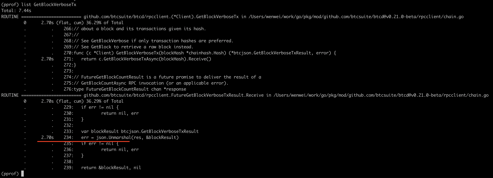

# Bitcoin JSON-RPC Client - Golang
Another optimized Bitcoin JSON-RPC client implemented by GoLang.  

### Why we need to re-implement
A picture is worth a thousand words:

Once a time I dig deeper into why my service with really stupid slow response as query bitcoin block via btcd rpc client. I figure out that json unmarshal in Golang standard library cost most of the time.  

This repository aim to optimize the performance between Go object and JSON conversion.